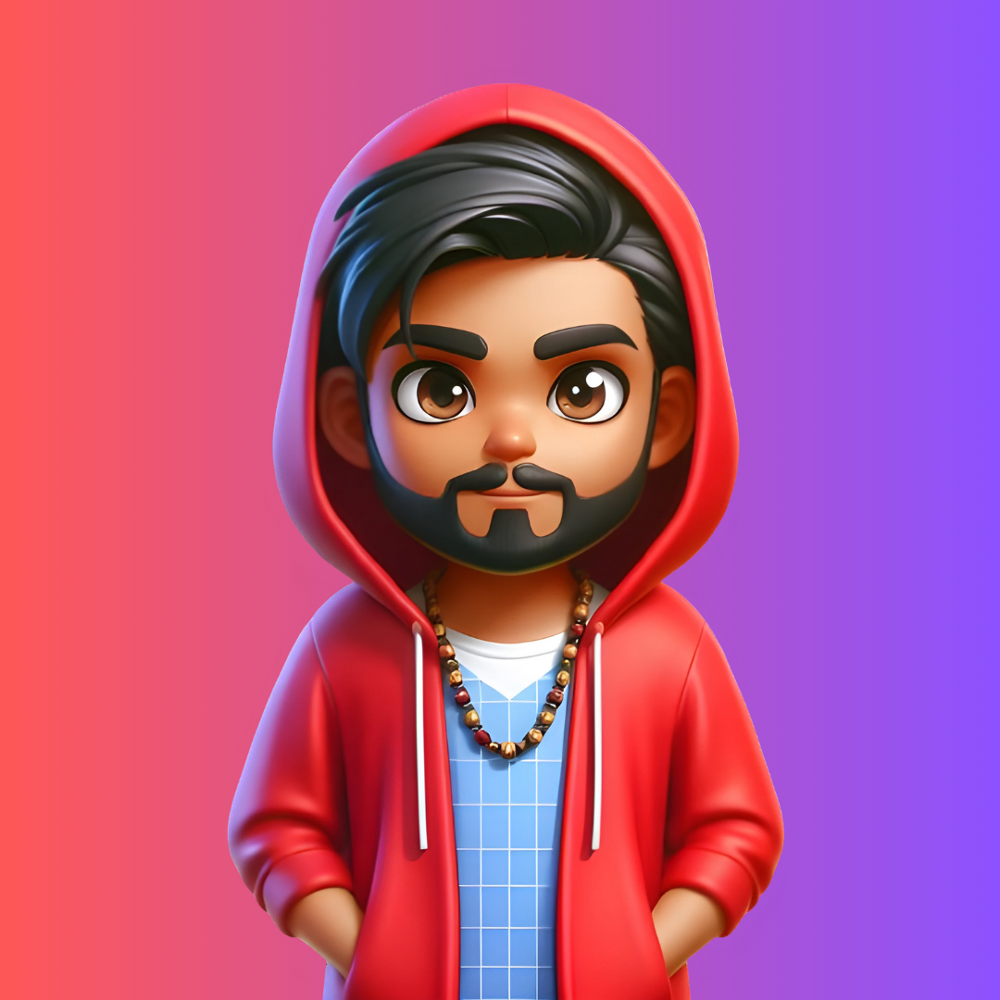

# Aryan Bajpai

  

  

Hey! 👋 I'm Aryan Bajpai, a passionate tech enthusiast from India, dedicated to creating extraordinary digital experiences. With a diverse skill set in web development, AI, and software engineering, I strive to build innovative applications and contribute to dynamic, growth-oriented teams.

## 🚀 Expertise

<ul>
  <li>💻 Full Stack Developer</li>
  <li>🤖 AI Enthusiast</li>
  <li>🎨 UI/UX Designer</li>
  <li>📊 API Specialist</li>
  <li>🐍 Python Programmer</li>
</ul>

## 🌐 Web Development

I specialize in building robust, user-centric web applications using:

  - **Frontend**:  HTML5,  CSS3,  JavaScript,  React.js,  Next.js
  - **Backend**:  Node.js,  Express,  Django
  - **Databases**:  MongoDB,  MySQL</li>

## 🧠 AI and Machine Learning

With a keen interest in AI, I develop intelligent solutions ranging from chatbots to applications in natural language processing and computer vision.

## 🎨 Design and Creativity

Combining creativity with functionality, I excel in UI/UX design and graphic design using:

<ul>
  <li> Figma,  Adobe XD</li>
  <li> Photoshop,  Illustrator</li>
</ul>

## 💻 Programming Skills

Proficient in Python, C++, and C, I develop scalable backend systems and optimize algorithms.

## 🌟 Technical Skills

  
  
  
  
  
  
  
  
  
  
  

## ☁️ Cloud Services

  
  

## 💼 Work Experience

**Internshala Student Partner**  
Internshala, June 2023 - August 2023  
- Contributed to business marketing by promoting deals and products through various marketing activities.
- Strategically planned and executed marketing campaigns, convincing peers and college colleagues to engage with products and deals.

## 📜 Certifications

- **AI for India 2.0** by GUVI in collaboration with Skill India Digital
- **Python Certificate** by GUVI
- **5-Star Problem Solving** on HackerRank
- **Infosys Springboard Certification**: HTML5, CSS3, Twitter Bootstrap, JavaScript, and Python Programming

## 🚀 Let's Connect

- 🔗 [Portfolio](https://portfolioxaryan.vercel.app/)
- 🐦 [Twitter](https://x.com/codernotme)
- 📷 [LinkedIn](https://www.linkedin.com/in/codernotme/)
- 📧 Email: aryanbajpai2411@gmail.com

Feel free to reach out for collaborations, projects, or just to say hi! Let's create something amazing together. 🚀

## 📊 GitHub Stats

## 🎵 GitHub Trophies

## 🌟 Top Languages

