<!-------------------------------------------------------------------------------------------------------------------------------------------------->
<!-- Aryan's Profile Bar -->
<!-------------------------------------------------------------------------------------------------------------------------------------------------->

<div align="center" style="margin: 20px 0;">
    <a href="https://codernotme.me" target="_blank">
        
    </a>
</div>

<!-------------------------------------------------------------------------------------------------------------------------------------------------->
<!-- Read-me Typing -->
<!-------------------------------------------------------------------------------------------------------------------------------------------------->

<div align="center">
    <a href="https://github.com/codernotme">
        
    </a>
</div>

<!-------------------------------------------------------------------------------------------------------------------------------------------------->
<!-- Intro -->
<!-------------------------------------------------------------------------------------------------------------------------------------------------->

<h3 align="center">
    <samp>
        &gt; Hey There! I am
        <b><a target="_blank" href="https://www.linkedin.com/in/codernotme/">Aryan</a></b>
    </samp>
</h3>

<!-- Search -->
<p align="center"> 
    <samp>
        <a href="https://www.linkedin.com/in/codernotme/">「 Connect with me 」</a>
        <br>
        「 Frontend developer by day, lifelong learner always! 」
        <br>
    </samp>
</p>

<h3 align="center">
    Web Developer || Python Enthusiast || AI Enthusiast || Innovator
</h3>

<!-------------------------------------------------------------------------------------------------------------------------------------------------->
<!-- Footer Bar -->
<!-------------------------------------------------------------------------------------------------------------------------------------------------->

<div align="center">
    <a href="https://github.com/codernotme">
        
    </a>
</div>

<!---------------------------------------------------------------------------------------------------------------------------------------------------------->
<!----- Visitor Badge + Links ------------------------------------------------------------------------------------------------------------------------------>
<!---------------------------------------------------------------------------------------------------------------------------------------------------------->
  
<hr>
<div align="center">
  <a href="https://visitorbadge.io/status?path=codernotme"></a>
    <br><br>
  <a href="https://dev.to/codernotme"></a>
  <a href="https://www.linkedin.com/in/codernotme/"></a>
  <a href="mailto:aryanbajpai2411@gmail.com"></a>

</div>
<hr>
  
</div>

<!---------------------------------------------------------------------------------------------------------------------------------------------------------->
<!----- About me ------------------------------------------------------------------------------------------------------------------------------------------->
<!---------------------------------------------------------------------------------------------------------------------------------------------------------->
<hr>

<div align="center">
    <h3>🌟 Let’s Connect and Collaborate! 🌟</h3>
    <ul style="list-style: none; padding: 0; text-align: left; max-width: 600px; margin: 0 auto;">
        <li>🔭 <b>What I’m Building:</b> Exploring the power of <i>Next.js</i>, <i>Django</i> and designing slick interfaces with <i>AI tools</i>.</li>
        <li>🌱 <b>What I’m Learning:</b> Diving deeper into <i>Entrepreneurship</i>, mastering <i>my basics</i>, and keeping up with cutting-edge tech trends.</li>
        <li>💬 <b>What I Can Help With:</b> Web Development, App Creation, crafting seamless user experiences, and Competitive Programming tips.</li>
        <li>📫 <b>Reach Me:</b> Shoot me a message via the links above 👆, or drop a note through <a href="mailto:aryanbajpai2411@gmail.com">email</a>.</li>
        <li>🤝 <b>Collaboration Interests:</b> Always excited for <i>Open Source Projects</i>, hackathons, and brainstorming innovative solutions.</li>
        <li>🌐 <b>Discover My Work:</b> Check out my portfolio at <a href="https://codernotme.me" target="_blank">My Portfolio</a> to see my latest projects and achievements.</li>
    </ul>
    <p style="margin-top: 15px;">💡 Always curious, always learning, always building. Let’s create something extraordinary together! 🚀</p>
</div>

<hr>

<!-- Skill Set -->
<div align="center">
    <h1>Skill Set &nbsp;</h1>
    <h4>These technologies reflect my expertise and hands-on experience, enabling me to deliver impactful solutions.</h4>
</div>

<!-- Tech Stack Table -->
<table align="center" cellspacing="10">
  <tr>
    <td align="center" width="96">
        
        <br>C++
    </td>
    <td align="center" width="96">
        
        <br>Python
    </td>
    <td align="center" width="96">
        
        <br>JavaScript
    </td>
    <td align="center" width="96">
        
        <br>TypeScript
    </td>
    <td align="center" width="96">
        
        <br>MySQL
    </td>
    <td align="center" width="96">
        
        <br>MongoDB
    </td>
    <td align="center" width="96">
        
        <br>PostgreSQL
    </td>
  </tr>
  <tr>
    <td align="center" width="96">
        
        <br>HTML
    </td>
    <td align="center" width="96">
        
        <br>CSS
    </td>
    <td align="center" width="96">
        
        <br>Bootstrap
    </td>
    <td align="center" width="96">
        
        <br>React
    </td>
    <td align="center" width="96">
        
        <br>NextJS
    </td>
    <td align="center" width="96">
        
        <br>Tailwind CSS
    </td>
    <td align="center" width="96">
        
        <br>jQuery
    </td>
  </tr>
  <tr>
    <td align="center" width="96">
        
        <br>GitHub
    </td>
    <td align="center" width="96">
        
        <br>Node.js
    </td>
    <td align="center" width="96">
        
        <br>Express.js
    </td>
    <td align="center" width="96">
        
        <br>Django
    </td>
    <td align="center" width="96">
        
        <br>REST API
    </td>
    <td align="center" width="96">
        
        <br>AWS
    </td>
    <td align="center" width="96">
        
        <br>Docker
    </td>
  </tr>
</table>

<!-- Additional Sections -->
<div align="center">
    <h3><b>Programming Languages</b></h3>
    
    
    
</div>

<div align="center">
    <h3><b>Cloud & DevOps</b></h3>
    
    
    
    
</div>

<div align="center">
    <h3><b>Tools</b></h3>
    
    
    
</div>

<div align="center">
    <h3><b>Operating Systems</b></h3>
    
    
    
</div>

<hr>

<!-- About me  -->

```js
AboutMe = {
  bio: "Passionate about creating seamless and powerful web solutions, focusing on frontend elegance and backend efficiency.",
  mission:
    "Leveraging Python and AI, I aim to push the boundaries of web technologies to build memorable digital experiences.",
  expertise:
    "With a strong foundation in Next.js, Golang, and DevOps, I seamlessly blend creativity and functionality to craft innovative solutions.",
  identity:
    "I am more than a student; I am a creator, a problem solver, and a developer with a drive to make an impact.",
  callToAction:
    "Together, let's push the boundaries of what's possible and shape a future powered by code. ✨",
};
```

<hr>
<div align="center">

#  GitHub Stats

<details>
<p align="center">
  <a href="https://github.com/codernotme">
    
  </a>
</p>

<p align="center">
  <a href="https://github.com/codernotme">
    
  </a>
</p>

<hr>
<div align="center">
<a> 
<!--     <a href="https://github.com/codernotme"></a> -->

  <div align="center">
  <a href="https://github.com/codernotme"></a>
  <br>
</a>

<!--- Aryan's Quotes ----------------------------------------------------------------------------------------------------------------------------->

  <hr><div align="center">

#  Technology Joke


<hr>

#  Developers' Quotes

[](https://github.com/piyushsuthar/github-readme-quotes)

</div>

<!--- Aryan's Activity Graph ----------------------------------------------------------------------------------------------------------------------------->


<!--- ------------------------------------------------------------------------------------------------------------------------------------------------------ -->
<!--- -- Metrics ------------------------------------------------------------------------------------------------------------------------------------------- -->
<!--- ------------------------------------------------------------------------------------------------------------------------------------------------------ -->

#  My GitHub Metrics

</details>

|                                  Overview                                  |                          Follow up Issues & PRs                           |
| :------------------------------------------------------------------------: | :-----------------------------------------------------------------------: |
|  |              |
|                                Achievements                                |                                 Reactions                                 |
|                     |                          |

<br>

<!--- Aryan's Coding Profiles   ---------------------------------------------------------------------------------------------------------------------------->

## Coding Profiles📈

<details>
<a href="https://leetcode.com/u/codernotme/">

</a>
</details>

<!--- Aryan's HacktoberFest  ----------------------------------------------------------------------------------------------------------------------------->

[](https://holopin.io/@codernotme)


