<!-- Hero Banner -->
<div align="center">
  💬 Discord Community</h3>Developer%20%7C%20AI%20Enthusiast%20%7C%20Problem%20Solver&descAlignY=55&descAlign=62"/>
</div>

<!-- Profile Image with enhanced styling -->
<div align="center">
  
  <br><br>
  
</div>

<!-- GitHub Stats & Profile Overview -->
<div align="center">
  <h2>📊 GitHub Analytics</h2>
  
  <!-- Main GitHub Widget -->
  
  
  <br><br>
  
  <!-- Detailed Stats Cards -->
  
  
  <br><br>
  
  <!-- Achievement Counters -->
  <table>
    <tr>
      <td align="center">
        
      </td>
      <td align="center">
        
      </td>
      <td align="center">
        
      </td>
      <td align="center">
        
      </td>
    </tr>
  </table>
</div>

<!-- Social Connect & Platforms -->
<div align="center">
  <h2>🌐 Connect & Collaborate</h2>
  
  <!-- Main Social Links -->
  <p>
    <a href="https://www.linkedin.com/in/codernotme/" target="_blank">
      
    </a>
    <a href="mailto:aryanbajpai2411@gmail.com">
      
    </a>
    <a href="https://codernotme.me" target="_blank">
      
    </a>
    <a href="http://tacklestudioz.com/" target="_blank">
      
    </a>
  </p>
  
  <!-- Coding Platforms -->
  <p>
    <a href="https://leetcode.com/u/codernotme/" target="_blank">
      
    </a>
    <a href="https://www.hackerrank.com/profile/cs_2201641520203" target="_blank">
      
    </a>
    <a href="https://codeforces.com/profile/codernotme" target="_blank">
      
    </a>
    <a href="https://discord.gg/bzuk2KVpQx" target="_blank">
      
    </a>
  </p>
  
  <!-- Blog Platforms -->
  <p>
    <a href="https://dev.to/codernotme" target="_blank">
      
    </a>
    <a href="https://hashnode.com/@codernotme" target="_blank">
      
    </a>
    <a href="https://twitter.com/codernotme" target="_blank">
      
    </a>
  </p>
  
  <!-- Profile Stats -->
  <p>
    
    
    
  </p>
</div>

<!-- Divider -->


<!-- About Me Section -->
<details>
<summary><h2>🚀 About Me</h2></summary>

<div align="center">
  <table>
    <tr>
      <td width="50%">
        
### 🔭 What I'm Currently Working On
- 🌐 Building scalable web applications with **Next.js** and **Django**
- 🤖 Exploring **AI/ML** integration in web development
- 📱 Crafting responsive and intuitive user interfaces
- 🔧 Optimizing application performance and user experience

### 🌱 What I'm Learning
- 🚀 Advanced **React** patterns and **TypeScript**
- ☁️ **Cloud Architecture** and **DevOps** practices
- 🧠 **Machine Learning** and **AI** technologies
- 📈 **Entrepreneurship** and startup methodologies

      </td>
      <td width="50%">
        
### 💬 Ask Me About
- 💻 **Full-Stack Development** (MERN, Django, Next.js)
- 🎨 **UI/UX Design** and **Frontend Optimization**
- 🔍 **Competitive Programming** strategies
- 🌐 **Web Performance** and **SEO** best practices

### 🤝 Let's Collaborate On
- 🔓 **Open Source Projects**
- 🏆 **Hackathons** and coding competitions
- 💡 **Innovative Web Solutions**
- 🚀 **Startup Ideas** and MVP development

      </td>
    </tr>
  </table>
</div>

### 📊 Quick Stats
```javascript
const aryan = {
    name: "Aryan Bajpai",
    role: "Full Stack Developer & Entrepreneur",
    location: "India 🇮🇳",
    company: "Tackle Studioz",
    languages: ["JavaScript", "Python", "TypeScript", "C++"],
    frameworks: ["React", "Next.js", "Django", "Express.js"],
    databases: ["MongoDB", "PostgreSQL", "MySQL"],
    tools: ["Git", "Docker", "AWS", "VS Code"],
    currentFocus: "Building scalable web applications with modern tech stack",
    startup: "Tackle Studioz - Innovative Tech Solutions",
    funFact: "I debug with console.log and I'm not ashamed! 😄"
};
```

</details>

<!-- Divider -->


<!-- Startup & Company Section -->
<h2 align="center">🚀 My Startup Journey</h2>

<div align="center">
  <table>
    <tr>
      <td align="center" width="50%">
        <h3>🏢 Tackle Studioz</h3>
        <a href="http://tacklestudioz.com/" target="_blank">
          
        </a>
        <p><i>Innovative Tech Solutions & Digital Transformation</i></p>
        <ul style="text-align: left;">
          <li>🎯 <b>Mission:</b> Empowering businesses with cutting-edge technology</li>
          <li>💡 <b>Focus:</b> Web Development, AI Integration, Cloud Solutions</li>
          <li>🌟 <b>Vision:</b> Making technology accessible and impactful</li>
          <li>🎉 <b>Founded:</b> 2023 - Growing strong!</li>
        </ul>
      </td>
      <td align="center" width="50%">
        <h3>👨‍💼 My Role</h3>
        <p><b>🎖️ Founder & Lead Developer</b></p>
        <br>
        <p>🔥 <b>What I Do:</b></p>
        <ul style="text-align: left;">
          <li>💻 Lead technical architecture decisions</li>
          <li>👥 Manage development team</li>
          <li>🎯 Drive product strategy & vision</li>
          <li>🤝 Client relations & project delivery</li>
          <li>📈 Business development & growth</li>
        </ul>
        <br>
        <a href="https://codernotme.me" target="_blank">
          
        </a>
      </td>
    </tr>
  </table>
</div>

<!-- Dynamic Projects Section -->
<h2 align="center">🛠️ Current Projects & Work</h2>

<div align="center">
  <p><i>Here's what I'm actively working on - updated dynamically!</i></p>
  
  <!-- GitHub Repositories -->
  <h3>📂 Featured Repositories</h3>
  <p>
    <a href="https://github.com/codernotme?tab=repositories&sort=updated">
      
    </a>
  </p>
  
  <!-- Recent Activity -->
  <h3>⚡ Recent GitHub Activity</h3>
  <div align="left">
  
  <!--START_SECTION:activity-->
  <!-- This section will be automatically updated -->
  1. 🎉 Merged PR #42 in [codernotme/awesome-project](https://github.com/codernotme/awesome-project)
  2. 💪 Opened 3 issues in [codernotme/web-toolkit](https://github.com/codernotme/web-toolkit)
  3. 🗣 Commented on [#15](https://github.com/codernotme/ai-integration/issues/15)
  4. ❗️ Closed issue [#8](https://github.com/codernotme/portfolio/issues/8)
  5. 🎉 Merged PR #23 in [tackle-studioz/client-project](https://github.com/tackle-studioz/client-project)
  <!--END_SECTION:activity-->
  
  </div>
  
  <!-- Live Projects Counter -->
  <h3>📊 Project Statistics</h3>
  <p>
    
    
    
    
  </p>
</div>

<!-- Organizations Section -->
<h2 align="center">🏛️ Organizations & Communities</h2>

<div align="center">
  <table>
    <tr>
      <td align="center" width="33%">
        <h3>🚀 Tackle Studioz</h3>
        <a href="http://tacklestudioz.com/" target="_blank">
          
        </a>
        <p><b>Founder & CEO</b></p>
        <p><i>Tech Solutions Company</i></p>
      </td>
      <td align="center" width="33%">
        <h3>💻 Open Source</h3>
        <a href="https://github.com/codernotme" target="_blank">
          
        </a>
        <p><b>Maintainer</b></p>
        <p><i>Community Projects</i></p>
      </td>
      <td align="center" width="33%">
        <h3>� Discord Community</h3>
        <a href="https://discord.gg/bzuk2KVpQx" target="_blank">
          
        </a>
        <p><b>Community Leader</b></p>
        <p><i>Coding & Tech Discussions</i></p>
      </td>
    </tr>
  </table>
</div>

<!-- Divider -->


<!-- Tech Stack Section -->
<h2 align="center">
   
  Tech Stack & Tools Arsenal 
  
</h2>

<div align="center">
  
  
  <br><br>

### 💻 Programming Languages
<p>
  
</p>

### 🎨 Frontend Development
<p>
  
</p>

### ⚙️ Backend Development
<p>
  
</p>

### 🗄️ Databases & Cloud
<p>
  
</p>

### 🔧 Tools & Technologies
<p>
  
</p>

### 🎯 Currently Learning
<p>
  
</p>

<!-- Animated Tech GIFs -->
<br>
<div align="center">
  
  
  
  
  
</div>

<!-- Skill Progress Bars -->
<h3>📊 Skill Proficiency</h3>

| Technology | Proficiency |
|------------|-------------|
| JavaScript |  |
| Python |  |
| React |  |
| Node.js |  |
| Django |  |
| TypeScript |  |
| AWS |  |
| Docker |  |

</div>

<!-- Divider -->


<!-- Streamlined GitHub Analytics -->
<h2 align="center">
  
  📊 GitHub Analytics
  
</h2>

<div align="center">
  <!-- Main Stats Cards -->
  
  
  
  <br><br>
  
  <!-- Streak Stats -->
  
  
  <br><br>
  
  <!-- Activity Graph -->
  
</div>

<!-- Divider -->


<!-- Latest Blog Posts Section -->
<h2 align="center">📝 Latest Blog Posts & Articles</h2>

<div align="center">
  <p><i>Check out my latest thoughts, tutorials, and tech insights!</i></p>
  
  <!-- Blog Platforms -->
  <h3>✍️ Writing Platforms</h3>
  <p>
    <a href="https://dev.to/codernotme" target="_blank">
      
    </a>
    <a href="https://hashnode.com/@codernotme" target="_blank">
      
    </a>
    <a href="https://medium.com/@codernotme" target="_blank">
      
    </a>
  </p>
  
  <!-- BLOG:START -->
  <!-- This section will be automatically updated by GitHub Actions -->
  - 🔥 [How to Build Scalable Web Apps with Next.js](https://dev.to/codernotme) - Coming Soon
  - 🚀 [Python Tips and Tricks for Beginners](https://hashnode.com/@codernotme) - Coming Soon  
  - 💡 [My Journey into AI and Machine Learning](https://dev.to/codernotme) - Coming Soon
  - 🎯 [Best Practices for Full Stack Development](https://hashnode.com/@codernotme) - Coming Soon
  - 🌟 [Building a Startup: Lessons from Tackle Studioz](https://dev.to/codernotme) - Coming Soon
  <!-- BLOG:END -->
  
  <br>
  <h3>📊 Blog Statistics</h3>
  <p>
    
    
    
  </p>
</div>

<!-- Divider -->


<!-- Contributors & Followers Gallery -->
<h2 align="center">👥 Amazing People I Work With</h2>

<div align="center">
  <h3>🤝 Contributors & Collaborators</h3>
  <p><i>Thank you to all the amazing developers who contribute to my projects!</i></p>
  
  <!-- Contributors from repositories -->
  <a href="https://github.com/codernotme/codernotme/graphs/contributors">
    
  </a>
  
  <br><br>
  
  <!-- GitHub Followers -->
  <h3>🌟 GitHub Followers</h3>
  <p><i>Grateful for this incredible community!</i></p>
  
  <!-- Dynamic followers list -->
  <a href="https://github.com/codernotme?tab=followers">
    
  </a>
  
  <br><br>
  
  <!-- LinkedIn Network -->
  <h3>💼 LinkedIn Network</h3>
  <p><i>Connect with me on LinkedIn for professional networking!</i></p>
  
  <a href="https://www.linkedin.com/in/codernotme/" target="_blank">
    
  </a>
  
  <br><br>
  
  <!-- Call to Action for Collaboration -->
  <br>
  <h3>🎯 Want to Collaborate?</h3>
  <p>
    <a href="mailto:aryanbajpai2411@gmail.com">
      
    </a>
    <a href="https://www.linkedin.com/in/codernotme/" target="_blank">
      
    </a>
    <a href="https://github.com/codernotme" target="_blank">
      
    </a>
    <a href="https://discord.gg/bzuk2KVpQx" target="_blank">
      
    </a>
  </p>
</div>

<!-- Divider -->


<!-- Coding Profiles & Competitive Programming -->
<h2 align="center">
  
  🏆 Competitive Programming & Coding Mastery 
  
</h2>

<div align="center">
  
  
  <br><br>
  
  <!-- Enhanced Platform Badges with Icons -->
  <h3>🎯 Coding Platforms & Achievements</h3>
  <table>
    <tr>
      <td align="center">
        <a href="https://leetcode.com/u/codernotme/" target="_blank">
          
        </a>
        <br><sub>🥇 Algorithm Master</sub>
      </td>
      <td align="center">
        <a href="https://www.hackerrank.com/profile/cs_2201641520203" target="_blank">
          
        </a>
        <br><sub>⭐ 5-Star Problem Solver</sub>
      </td>
      <td align="center">
        <a href="https://codeforces.com/profile/codernotme" target="_blank">
          
        </a>
        <br><sub>🎖️ Contest Specialist</sub>
      </td>
    </tr>
    <tr>
      <td align="center">
        <a href="https://www.codechef.com/users/codernotme" target="_blank">
          
        </a>
        <br><sub>👨‍🍳 3-Star Cook</sub>
      </td>
      <td align="center">
        <a href="https://atcoder.jp/users/codernotme" target="_blank">
          
        </a>
        <br><sub>🎌 Rising Competitor</sub>
      </td>
      <td align="center">
        <a href="https://www.geeksforgeeks.org/user/codernotme/" target="_blank">
          
        </a>
        <br><sub>🤓 Knowledge Seeker</sub>
      </td>
    </tr>
  </table>
</div>

<!-- Enhanced Stats Grid -->
<div align="center">
  <h3>📊 Platform Statistics & Achievements</h3>
  
  <table>
    <tr>
      <td align="center" width="50%">
        <h3>🎯 LeetCode Journey</h3>
        
        <a href="https://leetcode.com/u/codernotme/" target="_blank">
          
        </a>
        <br><br>
        
        <br><br>
        <!-- Enhanced LeetCode Badges with Animations -->
        <p>
          
          
        </p>
        <p>
          
          
        </p>
      </td>
      <td align="center" width="50%">
        <h3>🏅 HackerRank Mastery</h3>
        
        
        <br><br>
        
        <a href="https://www.hackerrank.com/profile/cs_2201641520203" target="_blank">
          
        </a>
        <br><br>
        
        <!-- Enhanced HackerRank Stats with Visual Appeal -->
        <div align="center">
          <h4>🎖️ Domain Expertise & Certifications</h4>
          <table style="width: 100%;">
            <tr>
              <td align="left">⭐ <b>Problem Solving:</b></td>
              <td align="right">⭐⭐⭐⭐⭐ 5-star</td>
            </tr>
            <tr>
              <td align="left">🐍 <b>Python:</b></td>
              <td align="right">⭐⭐⭐⭐⭐ 5-star</td>
            </tr>
            <tr>
              <td align="left">☕ <b>Java:</b></td>
              <td align="right">⭐⭐⭐⭐ 4-star</td>
            </tr>
            <tr>
              <td align="left">💾 <b>SQL:</b></td>
              <td align="right">⭐⭐⭐⭐ 4-star</td>
            </tr>
            <tr>
              <td align="left">🏗️ <b>Data Structures:</b></td>
              <td align="right">⭐⭐⭐⭐ 4-star</td>
            </tr>
            <tr>
              <td align="left">🧮 <b>Algorithms:</b></td>
              <td align="right">⭐⭐⭐⭐ 4-star</td>
            </tr>
          </table>
        </div>
        <br>
        <!-- HackerRank Achievement Badges -->
        <p>
          
          
        </p>
        <p>
          
          
        </p>
      </td>
    </tr>
  </table>
</div>

<!-- Additional Platforms -->
<div align="center">
  <h3>🌟 More Coding Achievements</h3>
  <table>
    <tr>
      <td align="center" width="33%">
        <h4>🔴 Codeforces</h4>
        <a href="https://codeforces.com/profile/codernotme" target="_blank">
          
        </a>
        <p>
          
        </p>
      </td>
      <td align="center" width="33%">
        <h4>👨‍🍳 CodeChef</h4>
        <a href="https://www.codechef.com/users/codernotme" target="_blank">
          
        </a>
        <p>
          
        </p>
      </td>
      <td align="center" width="33%">
        <h4>🎌 AtCoder</h4>
        <a href="https://atcoder.jp/users/codernotme" target="_blank">
          
        </a>
        <p>
          
        </p>
      </td>
    </tr>
  </table>
</div>

<!-- Coding Achievement Summary -->
<div align="center">
  <h3>📊 Overall Coding Statistics</h3>
  <table>
    <tr>
      <td align="center">
        
      </td>
      <td align="center">
        
      </td>
      <td align="center">
        
      </td>
      <td align="center">
        
      </td>
    </tr>
  </table>
  
  <!-- Programming Skills Progress -->
  <h3>🎯 Problem Solving Skills</h3>
  <div align="left" style="max-width: 600px; margin: 0 auto;">
    
| Skill Category | Progress | Level |
|----------------|----------|-------|
| 🔢 Array & Strings |  | Expert |
| 🌳 Trees & Graphs |  | Expert |
| ⚡ Dynamic Programming |  | Advanced |
| 🔠Searching & Sorting |  | Expert |
| 🧮 Mathematics |  | Advanced |
| 🯠Greedy Algorithms |  | Expert |
| 🔗 Linked Lists |  | Expert |
| 📊 Stack & Queue |  | Expert |

  </div>
  
  <!-- Competitive Programming Journey -->
  <h3>🚀 My Competitive Programming Journey</h3>
  <p><i>Started coding in 2021 • Solved 800+ problems • Participated in 50+ contests • Always learning! 📈</i></p>
  
  <!-- Achievement Badges -->
  <p>
    
    
    
    
  </p>
</div>

<!-- Divider -->


<!-- GitHub Metrics -->
<details>
<summary><h2>📈 Detailed GitHub Metrics</h2></summary>

<div align="center">
  
|                                  Overview                                  |                          Follow up Issues & PRs                           |
| :------------------------------------------------------------------------: | :-----------------------------------------------------------------------: |
|  |              |
|                                Achievements                                |                             Language Activity                             |
|                     |         |
|                                Discussions                                 |                                 Reactions                                 |
|                       |                          |

</div>
</details>

<!-- Divider -->


<!-- Fun Section -->
<h2 align="center">🎉 Just for Fun</h2>

<div align="center">
  
### 😄 Random Dev Joke


### 💭 Developer Quote
[](https://github.com/piyushsuthar/github-readme-quotes)

</div>

<!-- Divider -->


<!-- Holopin Badges -->
<div align="center">
  <h2>🏅 Achievements</h2>
  <a href="https://holopin.io/@codernotme">
    
  </a>
</div>

<!-- Enhanced Snake Game Section -->
<div align="center">
  <h2>
    
    🐍 Snake Game - My GitHub Contributions
    
  </h2>
  
  <!-- Enhanced Snake Animation -->
  <picture>
    <source media="(prefers-color-scheme: dark)" srcset="https://raw.githubusercontent.com/codernotme/codernotme/output/github-contribution-grid-snake-dark.svg">
    <source media="(prefers-color-scheme: light)" srcset="https://raw.githubusercontent.com/codernotme/codernotme/output/github-contribution-grid-snake-light.svg">
    
  </picture>
  
  <!-- Alternative Snake if the above doesn't work -->
  <details>
  <summary>🎮 Alternative Contribution Visualizations</summary>
  <br>
  
  </details>
</div>

<!-- Enhanced Footer with more interactivity -->
<div align="center">
  
</div>

<!-- Call to Action Section -->
<div align="center">
  <h2>🤝 Let's Collaborate!</h2>
  <p>
    
  </p>
  
  <!-- Action Buttons -->
  <p>
    <a href="mailto:aryanbajpai2411@gmail.com">
      
    </a>
    <a href="https://calendly.com/codernotme" target="_blank">
      
    </a>
    <a href="https://codernotme.me" target="_blank">
      
    </a>
  </p>
</div>

---

<!-- Inspirational Quote Section -->
<div align="center">
  <h3>💭 Daily Inspiration</h3>
  
</div>

---

<!-- Footer Message -->
<div align="center">
  <h3>
    
    Thanks for visiting my profile! 
    
  </h3>
  <p>
    <b>💡 "Code is poetry written in logic" 🚀</b><br>
    <i>Keep coding, keep learning, keep growing! ⭐</i>
  </p>
  
  <!-- Fun Fact -->
  <details>
  <summary>🎉 Fun Facts About Me & My Journey</summary>
  <br>
  <p>🎯 I can solve a Rubik's cube in under 2 minutes!<br>
  🎵 I code better with lo-fi music playing<br>
  ☕ Coffee is my debugging tool #1<br>
  🚀 Started Tackle Studioz during college<br>
  💼 Served 20+ clients across different industries<br>
  🌍 Built solutions used by thousands of users<br>
  🏆 Won 3 hackathons in the past year<br>
  🌟 I believe every bug is just a feature waiting to be understood!</p>
  </details>
  
  <br>
  
  <!-- Final Message -->
  <h3>🚀 From Code to Company</h3>
  <p>
    <b>💡 "Started as a developer, evolved into an entrepreneur"</b><br>
    <i>Tackle Studioz represents my journey from writing code to building solutions that matter.</i><br>
    <b>🎯 Always open to new opportunities and collaborations!</b>
  </p>
  
  <!-- Support Section -->
  <p>
    <b>⭐ If you like my work, consider:</b><br>
    🌟 Starring my repositories • 🤝 Connecting on LinkedIn • 💼 Checking out Tackle Studioz • 📧 Reaching out for collaborations<br>
    💼 Checking out Tackle Studioz<br>
    📧 Reaching out for collaborations<br>
    <i>Every connection and star motivates me to create more awesome projects! 🚀</i>
  </p>
</div>
